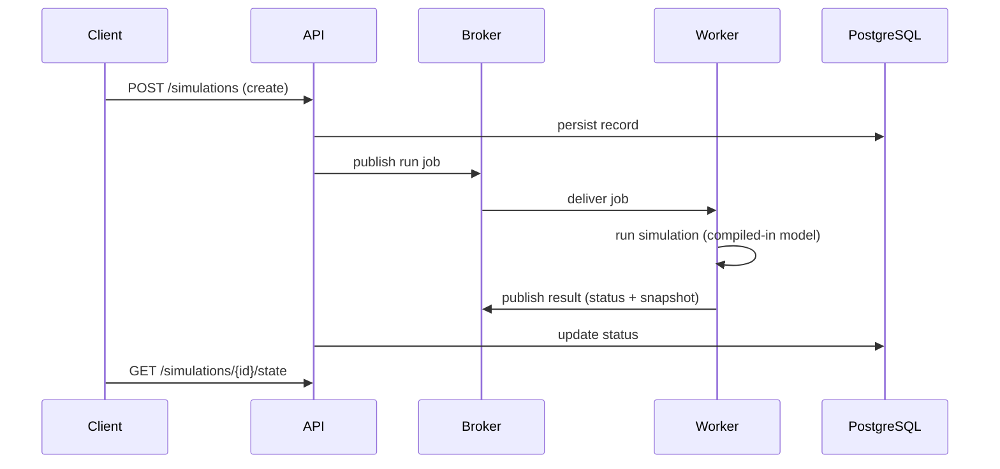

# Distributed execution

## Jobs

A `Job` carries a `RunJobPayload` (model ID/version, seed, mode, bounds,
config). The queue layer adds:

- **Retry** with exponential backoff up to `MaxAttempts`.
- **Dead-lettering** to a DLQ after the final attempt.
- **Idempotency**: a Redis `job:processed:<id>` claim (released on failure, kept
  24h on success) guarantees at-most-once execution under duplicate delivery.

## Workers

Workers register (metadata) and heartbeat (TTL) in Redis, then consume jobs
with RabbitMQ QoS=1 (one job at a time). They instantiate the model from the
compiled-in registry, so the same model runs in-process, as a local worker, or
across a cluster without changes.

## Failure handling

| Failure | Handling |
|---------|----------|
| Worker crash mid-job | message unacked → redelivered → retry/DLQ |
| Duplicate delivery | idempotency claim drops duplicates |
| Broker connection drop | reconnect with bounded exponential backoff |
| Redis unavailable | heartbeats/idempotency/rate-limit fail open |
| Simulation timeout/error | job result records `failed` status |
