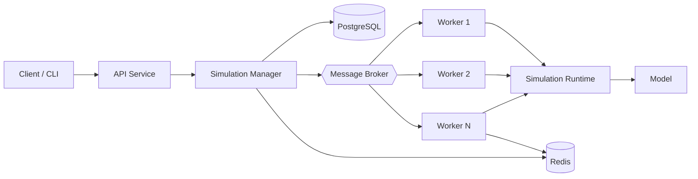

# Architecture overview

The simulator is a domain-agnostic distributed simulation runtime. A user
defines a model against the engine's generic primitives; the runtime executes it
locally or on a worker cluster.



## Layers

| Layer | Packages | Responsibility |
|-------|----------|----------------|
| Engine | `pkg/simulation`, `pkg/model`, `pkg/rng` | Domain-agnostic world, entities, components, events, clock, RNG, runtime |
| Models | `examples/*` | User-defined behavior consuming the engine |
| Runner | `internal/runner` | In-process simulation control + persistence |
| API | `internal/api` | HTTP lifecycle, auth, ownership, rate limiting |
| Distributed | `internal/broker`, `internal/queue`, `internal/workers`, `internal/coord` | Broker, jobs (retry/DLQ/idempotency), workers, Redis coordination |
| Persistence | `internal/database`, `internal/persistence` | pgx pool, migrations, sqlc repository |
| Observability | `internal/metrics`, `internal/observability` | Prometheus, OpenTelemetry, slog |

## Core abstraction

```
Simulation Runtime  +  User Model  =  Executable Simulation
```

The runtime controls execution (ticks/events, lifecycle, parallelism,
determinism); the model defines behavior. The runtime never knows what an entity
"is" — that meaning is supplied entirely by the model.

## Modes

- **Discrete tick** (`ModeTick`): a `TickModel.Step` (or a `SystemModel`'s
  dependency-ordered systems) runs once per tick.
- **Discrete event** (`ModeEvent`): an `EventModel.HandleEvent` runs for each
  event popped from the total-ordered queue.
