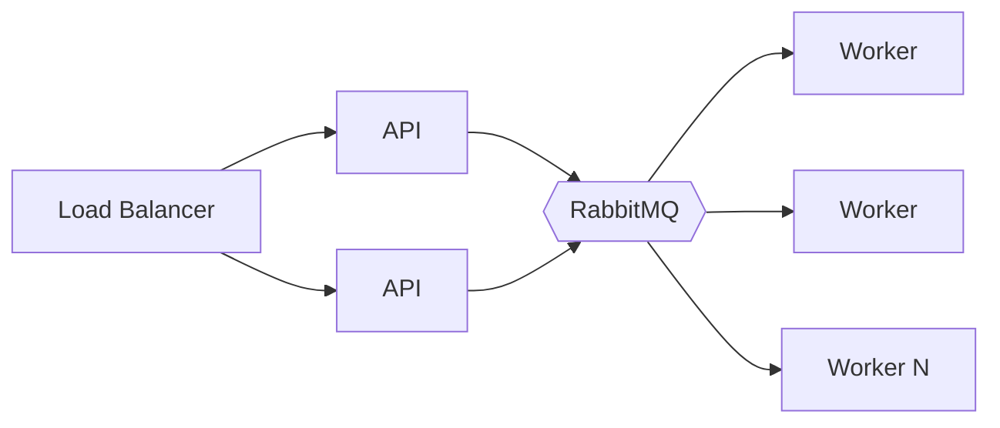

# Performance and scaling

## Performance

- SoA component storage and contiguous sharding are the primary performance
  choices; iteration is cache-friendly and values are unboxed.
- The parallel scheduler caches per-system entity sets (invalidated by a
  structural revision), so steady-state ticks do not rescan the component store.
- Benchmarks live in `examples/counter/benchmark_test.go` (`go test -bench`).
  Reported numbers include hardware, OS, and Go version; none are fabricated.

## Scaling

- **API** is nearly stateless (in-process control + Postgres) and scales behind
  a load balancer.
- **Workers** are stateless and scale horizontally; each processes one job at a
  time (QoS=1), so `replicaCount` bounds concurrent jobs.
- **Postgres/Redis/RabbitMQ** are the shared bottlenecks; scale them (clustered
  RabbitMQ, connection pooling, read replicas) before scaling workers.
- The known bottleneck measured in load testing is the PostgreSQL connection
  pool (default 4 connections) under concurrent create load (see
  `tests/load/README.md`); sizing the pool is tracked for the performance phase.

## Memory efficiency

- Per entity, components cost one `sparse` entry (4 bytes) per component type
  plus the value. 1M-entity CounterWorld measures ~24 ns/entity serial and
  ~16 ns/entity parallel per tick (steady state), with zero per-tick allocation
  after the initial entity-set build.
- Optimize only after profiling: `go test -benchmem`, `pprof`, `go tool trace`.
