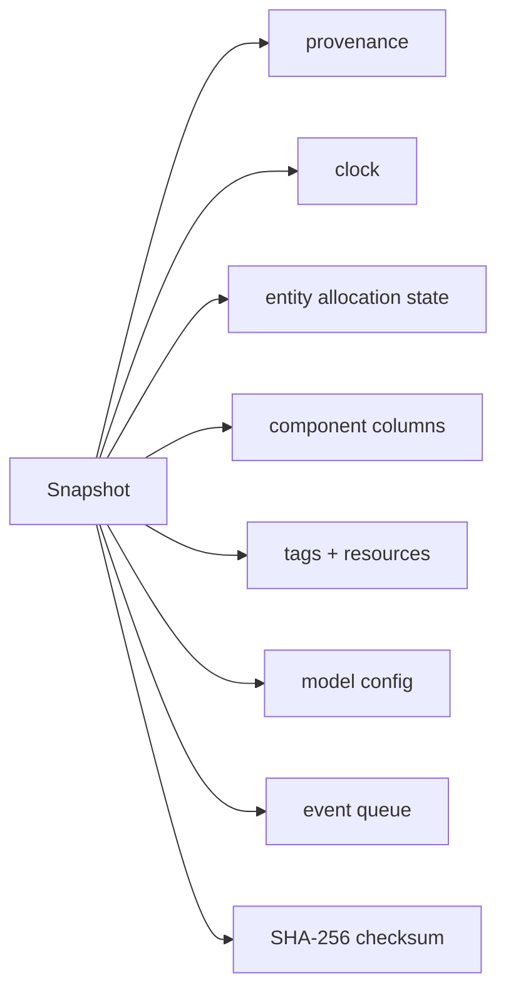

# Persistence, snapshots, and replay

## Persistence

PostgreSQL stores durable metadata and state:

- `models` (registry, versioned by `(id, version)`)
- `simulations` (seed, mode, status, config, owner)
- `snapshots` (versioned JSONB + checksum)
- `users` (argon2id hash, role)

Access is via `pgx/v5` + `sqlc` (no ORM) with embedded migrations.

## Snapshots

`World.Snapshot()` captures state; `World.Restore()` validates schema/engine
version and checksum, rejects model/seed mismatch, and rebuilds every subsystem.
`Simulation.Snapshot()` rejects a running simulation to avoid torn captures.

## Replay

Deterministic replay is achieved by re-creating a simulation from its recorded
seed + run config (`runConfig` persisted on the record) and re-running, or by
restoring a snapshot and continuing. Both paths are gated by determinism tests.
