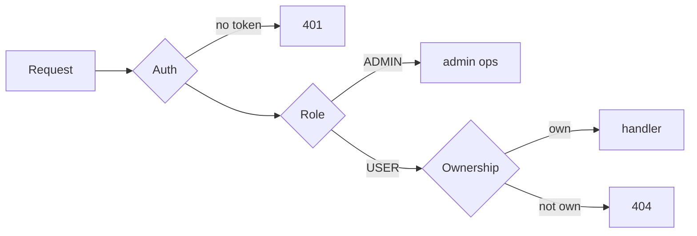

# Security and observability

## Security

- **Auth**: JWT access (15m) + refresh (24h) tokens, kind-tagged so they cannot
  be interchanged; argon2id password hashing (`m=64MiB, t=3, p=4`).
- **RBAC**: `USER`/`ADMIN`; `POST /models` requires `ADMIN`; admin bootstrapped
  via `ADMIN_USERNAME`/`ADMIN_PASSWORD`.
- **Ownership**: a single middleware enforces per-user access on every
  `/simulations/{id}/*` route (IDOR protection).
- **Rate limiting**: Redis fixed-window (atomic Lua) on create/start/snapshot/
  restore/replay/state; configurable via `RATE_LIMIT`.
- **Hardening**: request-size limits, timeouts (SSE exempt), recoverer,
  structured errors, no secrets in committed code.
- **Model isolation**: only trusted compiled-in models run in-process; untrusted
  models are out of scope for in-process execution (see ADR-013).

## Observability

- **Metrics**: Prometheus at `/metrics` — `simulation_started/completed/failed_total`,
  `simulation_active`, `simulation_tick_duration_seconds`, `snapshot_*`,
  `worker_jobs_*`, `queue_depth`.
- **Tracing**: OpenTelemetry (OTLP HTTP, enabled via `OTEL_EXPORTER_OTLP_ENDPOINT`),
  one span per request.
- **Logging**: structured `slog` JSON with request IDs.
- **Dashboards**: Grafana (Docker) with a provisioned dashboard.
