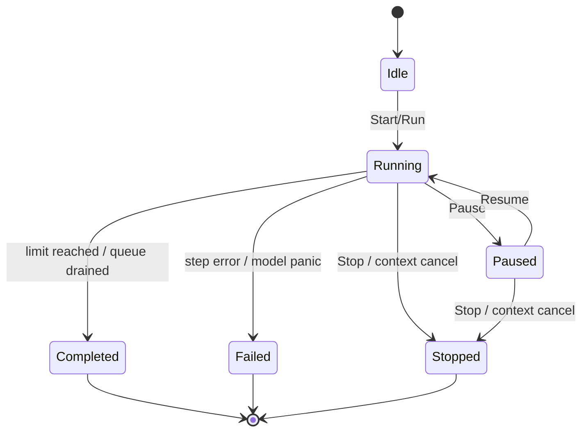
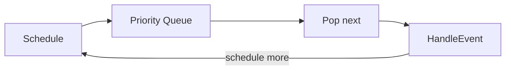
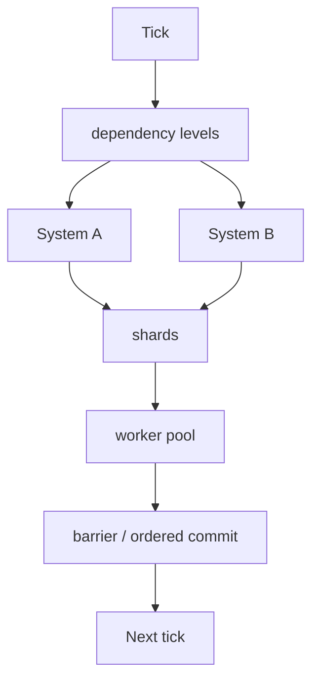

# Simulation runtime

## Lifecycle



The runtime loop is shared by both modes. A `defer` finalization guarantees
`cancel()` + `close(done)` even on model panic, converting a panic into
`StateFailed` so `Wait()` always returns.

## World model

```mermaid
flowchart TB
    W[World] --> E[Entity Manager]
    W --> C[Component Store]
    W --> R[Resources]
    W --> T[Tags]
    W --> Q[Event Queue]
    W --> K[Clock]
    W --> G[Random Streams]
    W --> M[Metadata]
    C --> C1[Column[Position]]
    C --> C2[Column[Velocity]]
    C --> C3[Column[...]]
```

- **Entity** = `EntityID` (index + generation) from a sparse set.
- **Component** = typed SoA `Column[T]` (dense data + sparse index).
- **Resource** = type-keyed singleton (shared, non-entity state).
- **Tag** = per-entity bitset label for filtering.

## Event system

Events carry ID, type, time, priority, sequence, source, target, and payload.
The queue is a priority heap with a **total order** `(time, priority, sequence,
id)`; the sequence is assigned at scheduling time, so ordering is deterministic.



## Scheduler & parallel execution



Systems declare `Reads`/`Writes`; conflicting systems serialize, independent
systems run concurrently, and each system's entities are partitioned into
contiguous shards executed on a bounded pool. Each entity is written by exactly
one shard, so results are independent of goroutine scheduling.

## Determinism

No global RNG; all randomness derives from a single seed via splitmix64 stream
derivation. Deterministic event order + deterministic shard commit + seed
derivation ⇒ same seed/config ⇒ same result, including under parallelism.
